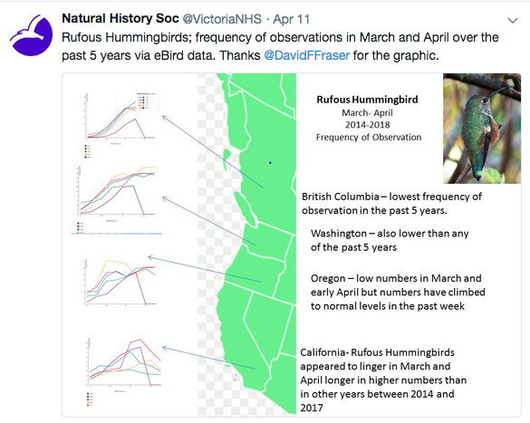

---
output:
  github_document:
    html_preview: true
---

```{r setup, include=FALSE}

knitr::opts_chunk$set(echo = TRUE, fig.height = 6,
                      fig.width = 8, fig.align = 'center',
                      warning = FALSE, message = FALSE,
                      cache = TRUE)

library(rebird) #get eBird data from the web
library(dplyr) #data munging
library(purrr) #map() for looping
library(ggplot2) #plotting
library(stringr) #clean you variables
library(lubridate) #make date data dates
library(tidyr) #separate month and quarter
library(rphylopic) #for image, package from GitHub
library(curl) #required by rphylopic function
```

# Where aRe the Rufus Hummingbirds?

</img>

When I saw the above analysis by my friend [Dave Fraser](https://twitter.com/DavidFFraser), I thought `r emo::ji("thought")`:

- cool analysis!
- citizen science + [eBird](https://ebird.org/) is awesome!
- have I seen a Rufus Hummingbird `r emo::ji("bird")` lately? 

and _then_ I thought ... 

- maybe you could do that analysis in R? `r emo::ji("idea")`

And it turns out you can.

## Getting the [eBird](https://ebird.org/) Data

You can get up-to-date eBird data via the [eBird website's View & Explore options](https://ebird.org/explore), but I was hoping to include more historical data and didn't want to click that often. The [full eBird data set](https://ebird.org/science/download-ebird-data-products) is available for download, but it is updated quarterly&mdash;so will not have the very recent observation records we are after. Sigh `r emo::ji("disappointed")`.

Then I talked to [Andy Teucher](https://github.com/ateucher) about my eBird data woes. He introduced me to the [rOpenSci](https://ropensci.org/) [R](https://www.r-project.org/) package `r emo::ji("package")` [`rebird`](https://cran.r-project.org/web/packages/rebird/index.html)&mdash;he is one of the package coauthors! `r emo::ji("+1")`

The [`rebird`](https://cran.r-project.org/web/packages/rebird/index.html) package `r emo::ji("package")` provides an interface with the eBird webservices&mdash;which in regular english means it goes and gets the eBird data from the web. It also returns the data in a [tidy](https://www.jstatsoft.org/article/view/v059i10) format, meaning the data are ready to work with the popular [tidyverse R packages](https://www.tidyverse.org/) `r emo::ji("package")` that many of us new to R have used to ease our way into coding.

OK, so let's start by pulling _A LOT_ of eBird data&mdash;50 years seems like a lot?

```{r get-data}

#load R packages we will need for getting the data
library(rebird) #get eBird data from the web using ebirdfreq()
library(dplyr) #data munging
library(purrr) #map() for looping

#thanks Andy for the purrr help!
#function to get eBird data for many states/provinces using rebird R package
map_state <-  function(state) {
  map_dfr(1968:2018, ~ {
    ebirdfreq("states", state, .x, .x, 1, 5) %>%
      filter(comName == "Rufous Hummingbird") %>%
      mutate(year = .x, state = state)
  })
}

#get eBird data for west coast state/provinces
ruhu_raw <- map_dfr(c("CA-BC","US-CA","US-WA", "US-OR"), ~ {
      map_state(.x)
})

head(ruhu_raw)

```

The eBird data provided by [`rebird`](https://cran.r-project.org/web/packages/rebird/index.html) is indeed very tidy. `r emo::ji("present")` Let's take a moment to cheers the [authors of and contributers to](https://github.com/ropensci/rebird/graphs/contributors) this open source R package. `r emo::ji("tada")`

## Some Data Wrangling 

There is still a bit of data cleaning or wrangling to do&mdash;there alway is and it would be less fun if there wasn't `r emo::ji("wink")`. We need to do something with the `monthQt` variable. This is our time variable, which we need for plotting. Right now it is coded as a character variable and it needs to be recognized as a date. And you might notice some zeros in the 2018 weeks that we have not yet lived&mdash;or birded. Let's filter out those zeros, they should really have been `NA`s?

```{r clean-data}

#we need a few more packages
library(stringr) #clean up variables
library(lubridate) #make date data dates
library(tidyr) #separate month and quarter

ruhu_clean <- ruhu_raw %>% 
  separate(monthQt, c("month", "week"), sep = "-") %>%
  mutate(day = case_when(
    week == 1 ~ 1,
    week == 2 ~ 8,
    week == 3 ~ 15,
    week == 4 ~ 23
  )) %>%
  mutate(date = ymd(paste0(year, "-",month,"-",day))) %>% 
  mutate(week = lubridate::week(date)) %>% 
  filter(sampleSize != 0) #filter out any zero that is actually an NA

head(ruhu_clean)

```

That looks `r emo::ji("eyes")` better!

## Some Exploratory Data Visualizing

Now let's have a quick, exploratory look `r emo::ji("eyes")` at what data we have, starting just with British Columbia.

```{r pre-viz}

#we need another package
library(ggplot2) #plotting

ruhu_clean %>% 
  filter(state == "CA-BC") %>%  #just B.C.
  ggplot(aes(x = week, y = frequency, group = year)) +
  geom_line(colour = "grey") +
  theme_minimal()

```

There seems to be a lot of very high frequency values in the data set (frequency = 1.0), which is a bit puzzling&mdash;all the birds observed were Rufus Hummingbirds `r emo::ji("question")`. Let's colour the lines for each year&mdash;using a continuous colour scale&mdash;to see if we learn something.

```{r colour-years}

ruhu_clean %>% 
  filter(state == "CA-BC") %>%  #just B.C.
  ggplot(aes(x = week, y = frequency, group = year)) +
  geom_line(aes(colour = year)) +
  theme_minimal()

```

Hmmmmm...this shows that most of that puzzling data is pre-2000s.  eBird launched in 2002, with birders able to enter observations instantly via smartphones. Andy&mdash;a birder and contributor to eBird&mdash;mentioned that maybe the older records are being entered by birders going through past checklists & field notebooks.Filtering out the pre-2002 data seems like a reasonable approach?

```{r filter-years}

ruhu_since_2002 <- ruhu_clean %>% 
  filter(year > 2001) 

ruhu_since_2002 %>% 
  filter(state == "CA-BC") %>%  #just B.C.
  ggplot(aes(x = week, y = frequency, group = year)) +
  geom_line(aes(colour = year)) +
  theme_minimal()

```

Looks `r emo::ji("eyes")` better! 

## How Do 2018 `r emo::ji("bird")` Observation Frequencies Compare with Historical Data?

Let's use some colour to distinguish the 2018 data from the previous year observation frequencies.

```{r bc-plot}

#make a small df with just 2018 data
df_bc_2018 <- ruhu_since_2002 %>% 
  filter(state == "CA-BC", year == 2018) 

ruhu_since_2002 %>% 
  filter(state == "CA-BC") %>% 
  ggplot(aes(x = week, y = frequency, group = year)) +
  geom_line(aes(colour = "grey"),  alpha = .5) +
  geom_line(data = df_bc_2018, aes(colour = "red")) +
  scale_colour_manual(name=NULL,
                      labels=c("2002-2017", "2018"),
                      values=c("grey", "red")) +
  theme_minimal()

```

This plot confirms the original analysis with the first 2018 Rufus Hummingbird observations later than most years since 2002. However, the rate of increase in observation frequency seems to be similar.

Let's look at all the Pacific Coast data now?

```{r wc-plot, fig.height = 8}

#make a small df with just 2018 data
df_2018 <- ruhu_since_2002 %>% 
  filter(year == 2018) 

ruhu_since_2002 %>% 
  ggplot(aes(x = week, y = frequency, group = year)) +
  geom_line(aes(colour = "grey"),  alpha = .5) +
  geom_line(data = df_2018, aes(colour = "red")) +
  facet_wrap(~ state, ncol=1) +
  scale_colour_manual(name=NULL,
                      labels=c("2002-2017", "2018"),
                      values=c("grey", "red")) +
  theme_minimal()

```

Interesting! But wait, while I'd like California to be a bit closer to British Columbia, I think I want the order of my facet plots to mirror the order along the Pacific Coast. Let's make sure the variable `state` is a factor _and_ in the order we want for plotting.

```{r wc-plot-ordered, fig.height = 8}

#we need another package
library(forcats) #for wrangling factors

#order for facet plotting
wc_order <- c("CA-BC","US-WA","US-OR","US-CA")

#make state a factor and order for facet plotting
ruhu_since_2002 <- ruhu_since_2002 %>% 
  mutate(state = factor(state, levels = wc_order))

#make a small df with just 2018 data
df_2018 <- ruhu_since_2002 %>% 
  filter(year == 2018) 

ruhu_since_2002 %>% 
  ggplot(aes(x = week, y = frequency, group = year)) +
  geom_line(aes(colour = "grey"),  alpha = .5) +
  geom_line(data = df_2018, aes(colour = "red")) +
  facet_wrap(~ state, ncol=1) +
  scale_colour_manual(name=NULL,
                      labels=c("2002-2017", "2018"),
                      values=c("grey", "red")) +
  theme_minimal()

```

Looks `r emo::ji("eyes")` better! 

And again, the plot confirms the original analysis&mdash;first observations are later and frequencies are lower for Rufus Hummingbirds, especially in Oregon, Washingtion and British Columbia.

Let's finish up with some window dressing for our plots, adding the usual suspects like a title and data attribution, and adding a nice silhouette of a hummingbird using the `rphylopic` R package `r emo::ji("package")`. Andy even suggested using the Rufus colour&mdash;`r emo::ji("perfect")`.

So final plot for **British Columbia**:

```{r nice-bc-plot}

#we need a couple more packages
library(rphylopic) #for image, package from GitHub
library(curl) #required by rphylopic function

## add image
hummer <- image_data("679605a3-95f1-4f57-be33-568640aca7b9", size = "512")[[1]]

#make a small df with just 2018 data
df_bc_2018 <- ruhu_since_2002 %>% 
  filter(state == "CA-BC", year == 2018) 

ruhu_since_2002 %>% 
  filter(state == "CA-BC") %>% 
  ggplot(aes(x = week, y = frequency, group = year)) +
  geom_line(aes(colour = "grey"),  alpha = .5) +
  geom_line(data = df_bc_2018, aes(colour = "orange3")) +
  scale_colour_manual(name=NULL,
                      labels=c("2002-2017", "2018"),
                      values=c("grey", "orange3")) +
  labs(title = "Frequency of Rufus Hummingbird Observations\nin British Columbia (2002-2018)",
       caption = "Data from eBird") +
  theme_minimal() +
  theme(legend.position = c(0.15, 0.3)) +
  add_phylopic(hummer, alpha = .7, color = "orange3", ysize = 7, x = 45, y = .3)

```

and final plot for the **Pacific Coast**:

```{r nice-wc-plot, fig.height = 8}

#order for facet plotting
wc_order <- c("CA-BC","US-WA","US-OR","US-CA")

#make state a factor and order for facet plotting
ruhu_since_2002 <- ruhu_since_2002 %>% 
  mutate(state = factor(state, levels = wc_order))

#make a small df with just 2018 data
df_2018 <- ruhu_since_2002 %>% 
  filter(year == 2018) 

ruhu_since_2002 %>% 
  ggplot(aes(x = week, y = frequency, group = year)) +
  geom_line(aes(colour = "grey"),  alpha = .5) +
  geom_line(data = df_2018, aes(colour = "orange3")) +
  facet_wrap(~ state, ncol=1) +
  scale_colour_manual(name=NULL,
                      labels=c("2002-2017", "2018"),
                      values=c("grey", "orange3")) +
  labs(title = "Frequency of Rufus Hummingbird Observations\nAlong the Pacific Coast (2002-2018)",
       caption = "Data from eBird") +
  theme_minimal() +
  theme(legend.position = "bottom") +
  add_phylopic(hummer, alpha = .7, color = "orange3", ysize = 3, x = 45, y = .3)

```


OK, I know. The silhouette is _not_ a Rufus Hummingbird. It is a _Topazza pella_&mdash;the Crimson Topaz&mdash;the only hummingbird image in the [phylopic library](http://phylopic.org/name/11887b47-ae28-4389-aaf8-16e204197b5b). At least it is a hummingbird?

For more on Rufus Hummingbirds (_Selasphorus rufus_), you can read the [species account in the The Birds of North America series](https://birdsna.org/Species-Account/bna/species/rufhum/introduction).

For keeping up with cool nature stuff in Victoria, British Columbia, you can follow the [Victoria Natural History Society twitter feed](https://twitter.com/VictoriaNHS).

If you see `r emo::ji("eyes")` a Rufus Hummingbird, you can add your observation to [eBird](https://ebird.org/).

